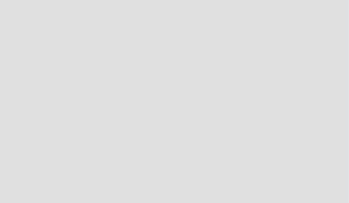
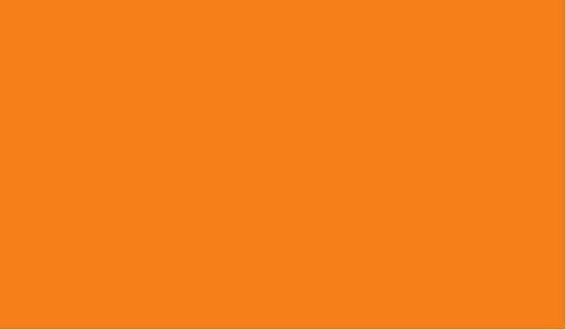
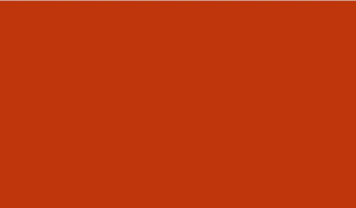

<h1 align="center">Popular More Popular</h1>
<h1 align="center"></h1>

:point_right: <a href="#">Live Website</a> :point_left:

:point_right: <a href="https://github.com/szomoru/MP2_popular-more-popular">Github Repository</a> :point_left:
 
 ## About

This website is a game website. The idea is comming from my 12years old son, who likes playing with the Higher or Lower game. This game  
There are tons of workout programs and personal trainers on the net, but there are still people who are struggling how start to work on a better themself. Sometimes people over mistify what they have to do and do not think about the simpliest, fastest solution. This website has been created to show those people that they do not need much to start to live a healthier life, specially when comes to the training. They do not need expensive gym subscription or personal trainers. They need just their Body. The goal of this website is to introduce the basic bodyweight exercises and answer some frequently asked questions. This website enjoyable on every device, so it is easy to acces in all circumstances.
 

## Table of Contents

[User Experience (UX)](#UX)

[Features](#features)

[Technologies Used](#technologies)

[Testing](#testing)

[Note about Search Volumes](#commits)

[Deployment](#deployment)

[Credits](#credits)

## User Experience (UX)

-   ### User stories

    -   #### First Time Visitor Goals

        1. As a First Time Visitor, I want to easily understand the content of the webpage and the game rules. I also would like to make a fast decision if this website interesting for me enough.
        2. As a First Time Visitor, I want to be able to easily navigate through the site and get an overal picture about the site structure.
        3. As a First Time Visitor, I want to see their social media availability, where i can get more information about the site or organisation / person behind that.
        4. As a first Time Visitor i want to find the possibility how to contact the person or organization behind the site. 

    -   #### Returning Visitor Goals

        1. As a Returning Visitor, I want to see that the gam,e is dynamic. So the comparization pairs are not repeated or if they are repeated the result is not necessarily the same.
        2. As a Returning Visitor, I want to see a contact form where i can ask questions or share my thoughts and comments.
        3. As a Returning Visitor, I want to find community links.

    -   #### Frequent User Goals
        1. As a Frequent User, I want to see if there are more type of games or more versions of the existing one.
        2. As a Frequent User, I want to sign up to a Newsletter so never miss any updates or news about the website and the topic.

-   ### Design

    -   #### Colour Scheme
        I tried to make the colour scheme as simple as possible to avoid disturbing color layouts. 
        I have used 4 main colors:
        - Light grey (Hex: #ab000d)  
        - Dark grey (Hex: #212121) 
        - Orange (Hex: #ab000d)  
        - Red (Hex: #212121)      
        The color combination was selected on the Material Design website (https://material.io/). I tried to select color combination which is not disturbing and do not bother the visitor, so they stay longer on the site if they wish.
        I also use basic warning or highlighter colors for their main usual meanings (red: not correct, green: correct, orange: selected etc ...) 

    -   #### Typography
        - There are two font families used on the site. Fredoka One and Montserrat. This font combination was selected on the googlefonts website (https://fonts.google.com/).
        There are fallback font families in those cases when the main fonts cannot be loaded for some reason. Cursive is the fallback font in the case of Fredoka One and Sans Serif for Montserrat. Both font families are representing very well the style of the webpage. They seems playfull and happy.      
        Fredoka One is used mainly for headings and titles or in the navigation menu, while Montserrat is used more in the texts and descriptions.
    
    -   #### Imagery
        -   Since the main topic of this website is to focuse on images and comparing them i wanted to keep the surroundings without any picture. I wanted to keep it neutral for the visitor to keep a good focus on the images for comparisation.