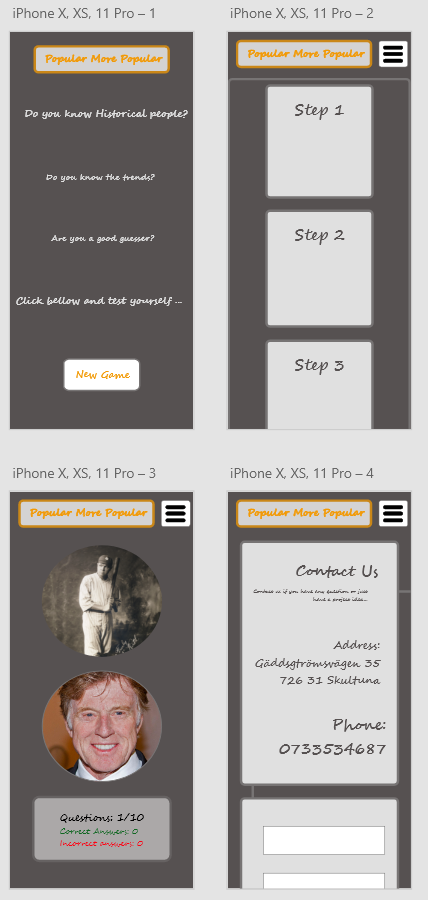
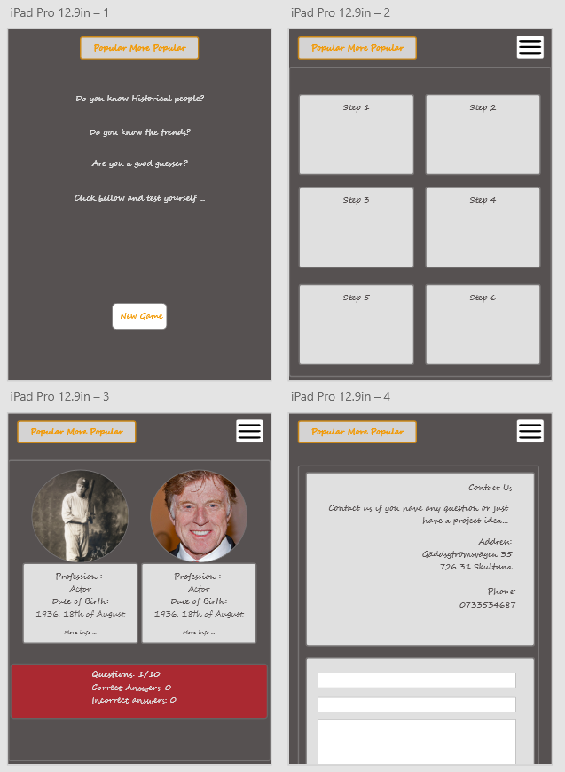
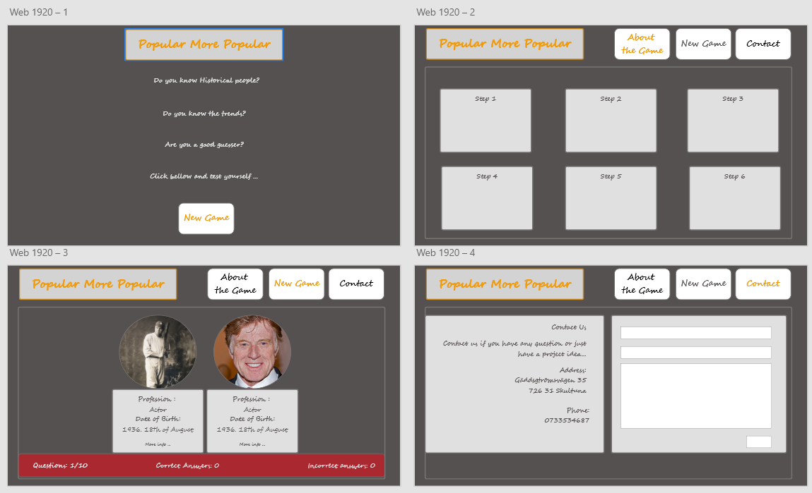
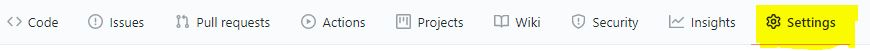
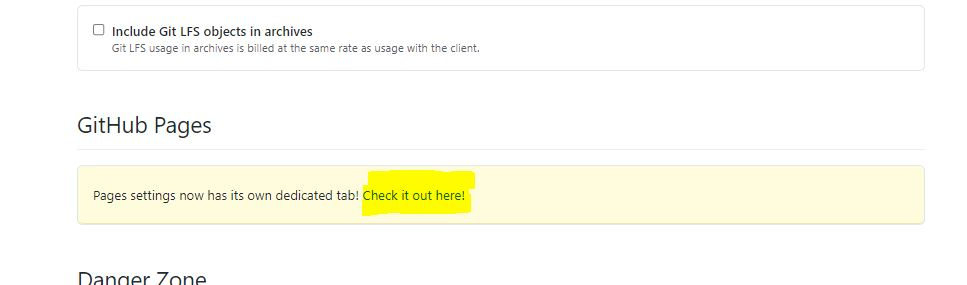
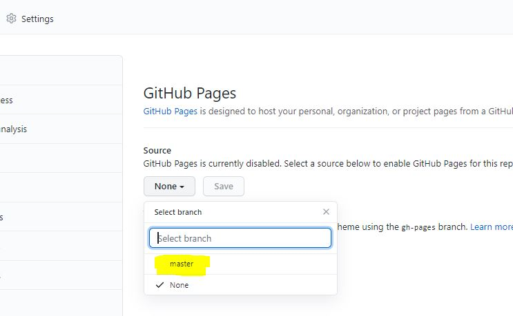
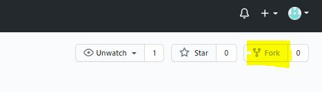
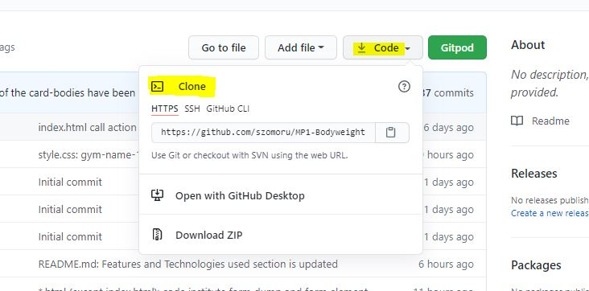

<h1 align="center">Popular More Popular</h1>
<h1 align="center"></h1>

:point_right: <a href="#">Live Website</a> :point_left:

:point_right: <a href="https://github.com/szomoru/MP2_popular-more-popular">Github Repository</a> :point_left:
 
 ## About

This website is a gaming website. The idea is comming from my 13 years old son, who likes playing with the Higher or Lower game. The target audience for this website is everyone who is interested in famous people and likes guessing. This website is not only about celebs it is about scientists historical people actresses and actors, musicians, novellists, so about everyone. If someone would like to know more any of the persons each of them has a link to her/his wikipedia page. 
The pairs are created randomly in each game. The dynamic of the game is given that the interest of the people changes all the time. Sometimes someone is more popular than the other, but the next period it can be total opposite. The comparisation supposed to happen based on the last 30 days search volume for the person name. 

## Table of Contents

[User Experience (UX)](#UX)

[Features](#features)

[Technologies Used](#technologies)

[JavaScripts](#scripts)

[Testing](#testing)

[Note about Search Volumes](#searchvolumes)

[Deployment](#deployment)

[Credits](#credits)


<a name="UX"></a>

## User Experience (UX)

-   ### User stories

    -   #### First Time Visitor Goals

        1. As a First Time Visitor, I want to easily understand the content of the webpage and the game rules. I also would like to make a fast decision if this website interesting for me enough.
        2. As a First Time Visitor, I want to be able to easily navigate through the site and get an overal picture about the site structure.
        3. As a First Time Visitor, I want to see their social media availability, where i can get more information about the site or organisation / person behind that.
        4. As a first Time Visitor i want to find the possibility how to contact the person or organization behind the site. 

    -   #### Returning Visitor Goals

        1. As a Returning Visitor, I want to see that the game is dynamic. So the comparization pairs are not repeated or if they are repeated the result is not necessarily the same.
        2. As a Returning Visitor, I want to see a contact form where i can ask questions or share my thoughts and comments.
        3. As a Returning Visitor, I want to find community links.

    -   #### Frequent User Goals
        1. As a Frequent User, I want to see if there are more type of games or more versions of the existing one.
        2. As a Frequent User, I want to follow the future developments and updates about the website and the topic.

-   ### Design

    -   #### Colour Scheme
        I tried to make the colour scheme as simple as possible to avoid disturbing color layouts. 
        I have used 4 main colors:
        - Light grey (Hex: #ab000d)  
        - Dark grey (Hex: #212121) 
        - Orange (Hex: #ab000d)  
        - Red (Hex: #212121)      
        The color combination was selected on the Material Design website (https://material.io/). I tried to select color combination which is not disturbing and do not bother the visitor, so they stay longer on the site if they wish.
        I also use basic warning or highlighter colors for their main usual meanings (red: not correct, green: correct, orange: selected etc ...) 


    -   #### Typography
        - There are two font families used on the site. Fredoka One and Montserrat. This font combination was selected on the googlefonts website (https://fonts.google.com/).
        There are fallback font families in those cases when the main fonts cannot be loaded for some reason. Cursive is the fallback font in the case of Fredoka One and Sans Serif for Montserrat. Both font families are representing very well the style of the webpage. They seems playfull and happy.      
        Fredoka One is used mainly for headings and titles or in the navigation menu, while Montserrat is used more in the texts and descriptions.
    
    -   #### Imagery
        -   Since the main topic of this website is to focus on images and comparing them, i wanted to keep the surroundings without any picture. I wanted to keep it neutral for the visitor to keep a good focus on the images for comparisation.

-   ### Wireframes

    -   There were several design changes during the development process, but the final site looks very similar with the wirframe. 

    -   Mobile Wireframe - [View](./assets/wireframes/Wireframe_Iphone_X_MP2.pdf)

        


    -   Ipad Pro Wireframe - [View](./assets/wireframes/Wireframe_IpadPro_MP2.pdf)

        


    -   Desktop Wireframe - [View](./assets/wireframes/Wireframe_Desktop_MP2.pdf)

        

    <a name="features"></a>        

    ## Features

    ### Present Features

    #### Features accross all Pages

    -   The website was designed to have the same structure on every pages. On this way the visitor feel comfortable and find her/his way on every page.
        The layout is the following:
        - On the top section there is the Header with Navigation links
        - The middel section is the largest "main" section on every page, which contains the main information.
        - The page is closed with the Footer, which in this case contains only a Copyright text. 

    - [x] **Header**
        - The header can be divided into 2 main section. The first one is the name of the site ("Popular more Popular") without any link, it is just a decoration element. 
        - The second main section is the "navigation" section with 3 navigation items:
            -   About the Game
            -   Game
            -   Contact
    - [x] **Main section**
        - The main section contains the page specific information on every page.
    - [x] **Footer**
        - Always located as the last element of the page. In this project it does not contain any important information not to steal the focus of the visitor.        

    #### Features specific to Pages

    - [x] **Landing page**
        - Hero imnage set to the background, which clearly represents the type of the webpage
        - A smaller window floating over the background, which highlight some topic of the content od the page and call to action
        - If the visitor accept the invitation and take action after clicking the "Learn more" button, gets to the Home page.
    - [x] **About the Game page**
        - This page is the first page, that is shown after the landing page. By seeing this page the visitor gets a short description about the game itslef.
        - The visitor also can see screenshots from the game, so when she/he starts to play they are already familiar with the layout.
        - As a last element on this page the visitor can click on a button, which takes her/him to the Game page and start the game
    - [x] **Game page**
        This Game page is the soul of this site. Visually it is divided into 3 sections:
        - Header element with a question
        - "Start New Game" button, which can be a pushed anytime during the game
        - Score area where the visitor can follow up how many question is used from the total 10 questions and also how many correct and wrong answer has the visitor.
        
        At the end of the game (after answering all the 10 questions), there are 2 modals which can be shown:
        - "Winner" modal:
            This modal is shown if the number of the correct answers larger or equal than the number of the wrong answers. 
        - "Loser" modal: 
            This modal is shown if the number of the correct answers smaller than the number of the wrong answers.
        The modal window also contains text and Smile icons to visulaize if the final result is positiv or negative.
        There is also a section which shows the statistics of the game (number of correct and wrong answers).
    - [x] **Contact page**
        This is the main page for the visitor if she/he wants to contact to the website developer.
        This page is divided into 2 main sections:
        - left side of the section contains a description in which cases the visitor can contact to the developer and also contains:
         - address
         - phone number
         - social media links
         of the developer. 
        - right section contains a contact form, where the visitor can leave her/his name/e-mail and the message.
         this feature is fully set up through the email.js website 
        

    ### Future Features
    This website and game is full of possibilities for future develpments and adding new features. Here are some possible future developments:
    - Adding a feature where the visitor can define the number of the questions her-/himself. 
    - Separate page with a form to uploading data into the database.
    - After a certain number of the database it makes sense to have the possibility to play games based on professions or sex or origin of people.  


<a name="technologies"></a>

## Technologies Used

### Languages Used

-   [HTML5](https://en.wikipedia.org/wiki/HTML5)
-   [CSS3](https://en.wikipedia.org/wiki/Cascading_Style_Sheets)
-   [JavaScript](https://en.wikipedia.org/wiki/JavaScript)

### Frameworks, Libraries & Programs Used

1. [Bootstrap 4.1.3:](https://getbootstrap.com/docs/4.4/getting-started/introduction/)
    - Bootstrap was used to assist with the responsiveness and styling of the website.
1. [Hover.css:](https://ianlunn.github.io/Hover/)
    - Hover.css was used on the Social Media icons in the footer and on all cards and menu items to highlight and scale while being hovered over them.
1. [Google Fonts:](https://fonts.google.com/)
    - Google fonts were used to import the 'Fredoka One' and 'Montserrat' fonts into the style.css file which is used on all pages throughout the project.
1. [Font Awesome:](https://fontawesome.com/)
    - Font Awesome was used on all pages throughout the website to add icons for aesthetic and UX purposes.
1. [jQuery:](https://jquery.com/)
    - jQuery came with Bootstrap 
1. [Git](https://git-scm.com/)
    - Git was used for version control by utilizing the Gitpod terminal to commit to Git and Push to GitHub.
1. [GitHub:](https://github.com/)
    - GitHub is used to store the projects code after being pushed from Git.
1. [Adobe XD:](https://www.adobe.com/se/products/xd.html)
    - Adobe XD free version was used to create [wireframes](./assets/wireframes/) during the design process.
1. [Beautify:]
    - To beautify my codes i have used the Bootstrap inbuilt beautify feature and Format Document feature.


<a name="scripts"></a>

## JavaScript

- ### database.js:
    this javascript file contains the database array. This array has 20 elements and each element has 6 object keys at this moment. 
- ### script.js:
    this javascript file contains all the functions which is running the game and updating the DOM
- ### sendEmail.js:
    this file contains only one function, which is sending the contact form information to the emailJS email service. 


<a name="testing"></a>

## Testing

The W3C Markup Validator and W3C CSS Validator Services were used to validate every page of the project to ensure there were no syntax errors in the project.

-   [W3C Markup Validator](https://jigsaw.w3.org/css-validator/#validate_by_input) 

    -   index.html                PASSED    [Result](https://validator.w3.org/nu/?doc=https%3A%2F%2Fszomoru.github.io%2FMP1-Bodyweight%2Findex.html)
    -   about.html                 PASSED    [Result](https://validator.w3.org/nu/?doc=https%3A%2F%2Fszomoru.github.io%2FMP1-Bodyweight%2Fhome.html)
    -   game.html             PASSED    [Result](https://validator.w3.org/nu/?doc=https%3A%2F%2Fszomoru.github.io%2FMP1-Bodyweight%2Fbenefits.html)
    -   contact.html            PASSED    [Result](https://validator.w3.org/nu/?doc=https%3A%2F%2Fszomoru.github.io%2FMP1-Bodyweight%2Fexercises.html)

-   [W3C CSS Validator](https://jigsaw.w3.org/css-validator/#validate_by_input) 

    -   style.css                 PASSED 
        
    :point_right: <a href="http://jigsaw.w3.org/css-validator/check/referer">
        
    </a> :point_left: Results

### Testing User Stories from User Experience (UX) Section

-   #### First Time Visitor Goals

    1. As a First Time Visitor, I want to easily understand the content of the webpage and the game rules. I also would like to make a fast decision if this website interesting for me enough.
        1. Entering to the page the visitor faces with Landing page where she/he can see text which already foreshadow the topic of the website. 
        2. With the "Let's play" button the visitor is called to action and this point she/he already knows that there is something fun and enjoyable waiting for her/him inside. 
    
    2. As a First Time Visitor, I want to be able to easily navigate through the site and get an overal picture about the site structure.
        1. After entering to the about page the visitor faces a well structured page. The structure of the page is the same as the rest of the site. With this the visitor does not have to facing different layouts and figure out what to do next. On the about page it is not only the strucutre what the visitor meets she/he gets an introduction to about the game as well.
        2. The navigation is located in the header section on all pages and the actual page is always highlighted. So the visitor always know where she/he is on the site.
    
    3. As a First Time Visitor, I want to see their social media availability, where i can get more information about the site or organisation / person behind that.
        1. Social media links are located on the Contact page. The visitor always has the possibility to visit these links and start to follow the website owner.
        2. The visitor always has the possibility to contact to the website owner and asking question through the contact form on the Contact page

    
    4. As a first Time Visitor i want to find the possibility how to contact the person or organization behind the site. 
        1.  The Visitor has the possibility to follow the website owner on any of the shared social media link and get automatic updates about the progress for the future. 
        2.   The Visitor always has the possibility to Contact the website owner and ask any question through the Contact form on the Contact page  


-   #### Returning Visitor Goals

    1. As a Returning Visitor, I want to see that the game is dynamic. So the comparization pairs are not repeated or if they are repeated the result is not necessarily the same.
        1. The comparization pairs are created randomly and an algorythm makes sure that the pairs are not repeated. This happens due that the database elements are shuffled by Fisher - Yates algorithm.
        2. The comparisation based on the last 30 days search volume for the "keywords(name)" globally. Depends on the peoples interest this can vary from period to period. 

    2. As a Returning Visitor, I want to see a contact form where i can ask questions or share my thoughts and comments.
        1.  This Contact form is clearly visible and accessable on the Contact page on any of the screen sizes and platforms
        2.  All the contact references are centralized on the Contact page. This comntains the social media links and contact form as well. The reason behind that is we do not want to steal the focus of the visitor from the game. If the visitor wants to contact to the website owner he can easily do that through the contact page, where all the possible contact references are available.
    
    3. As a Returning Visitor, I want to find community links.
        -  The community links can be found on the Contact page.

-   #### Frequent User Goals

    1. As a Frequent User, I want to see if there are more type of games or more versions of the existing one.
        1.  The development of the game is definietaly planned. The database is also updated regularly. The databese gets bigger and bigger. If the frequent user starts to follow the website owner on any of the given social media links, the visitor never will miss an update. All the future updates are going to be shared on social media sites, ther wont be separate mailings about that. That possibility can be added when membership possibility will be available for the site.

    2. As a Frequent User, I want to follow the future developments and updates about the website and the topic.
        1.  There are all the possible contact references on the contact page. It includes the social media links, where all the the future developments will be published.
        2.  If the user has a request to discuss a special topic it is possible to contact through a contact form on the Contact page.

### Further Testing

-   The Website was tested on Google Chrome, Internet Explorer, Microsoft Edge browsers.
-   The website was viewed on a variety of devices such as Desktop, Laptop, iPhoneSE, iPhone 6 & iPhone 11 Pro.
-   A large amount of testing was done to ensure that all pages were linking correctly.
-   Family members were asked to review the site and playing the game and documentation to point out any bugs and/or user experience issues.

### Functional Testing
-   During the development process and after that there were several tests carried out to validate the links. All external and internal links were tested several times.

### Known Bugs
At this point there are no known bugs but during the development process in the testing periods some bug has been detected. They were the following: 
-   on the game page the wikipedia link was unclickable. The highlighter layer overlayed the link. By trying to click on the link the game detected as a selection. This bug has been solved by decreasing the height of the overlaying highlighter layer.
-   By clicking on the wikipedia link on the info panel the link has been opened in a separate window as it should be. But parallel to this the game also detected as a selection, so the game changed to the next round. With this bug the player has lost the possibility to get extra information during the game. 
-   On the contact page after filling out and submitting the contact form the input content stayed the same. There was no feedback for the visitor if the submit button click was succesfull or not. This bug has been solved by emptying the input fields after clicking on the submit button and sending the message. 


<a name="searchvolumes"></a>

## Note about Search volumes
- The original plan was that the game using live search volume data through DataForSEO API. Since google has changed its analytics policies and usage couple of years ago, the best possibilities today to use a third party API from companies. Unfortunately these APIs are not free, so getting search volume data cost a lot of money depending on how many times we fetch data. 
Unfortunately i did not have the possibility to fill up a balance, so to keep the game dynamic i have decided to use fictional search volume data. Every time when a player starts a new game a random number generator fills up the search volume object in the database array. The random number generator generates a number between 0 and 1000000.  

<a name="deployment"></a>

## Deployment

### GitHub Pages

The project was deployed to GitHub Pages using the following steps...

1. Log in to GitHub and locate the [GitHub Repository](https://github.com/szomoru/MP2_popular-more-popular)
2. At the top of the Repository (not top of page), locate the "Settings" Button on the menu.
    - 
3. Scroll down the Settings page until you locate the "GitHub Pages" Section.
    - 
4. Under "Source", click the dropdown called "None" and select "Master Branch".
    - 
5. The page will automatically refresh.
6. Scroll back down through the page to locate the now published site [link](https://github.com) in the "GitHub Pages" section.

### Forking the GitHub Repository

By forking the GitHub Repository we make a copy of the original repository on our GitHub account to view and/or make changes without affecting the original repository by using the following steps...

1. Log in to GitHub and locate the [GitHub Repository](https://github.com/szomoru/MP2_popular-more-popular)
2. At the top of the Repository (not top of page) just above the "Settings" Button on the menu, locate the "Fork" Button.
    - 
3. You should now have a copy of the original repository in your GitHub account.

### Making a Local Clone

1. Log in to GitHub and locate the [GitHub Repository](https://github.com/szomoru/MP2_popular-more-popular)
2. Next to the green Gitpod button, click on the "Code" button.
3. To clone the repository using HTTPS, under "Clone with HTTPS", copy the link.
    - 
4. Open Git Bash
5. Change the current working directory to the location where you want the cloned directory to be made.
6. Type `git clone`, and then paste the URL you copied in Step 3.

```
$ git clone https://github.com/YOUR-USERNAME/YOUR-REPOSITORY
```

7. Press Enter. Your local clone will be created.

```
$ git clone https://github.com/YOUR-USERNAME/YOUR-REPOSITORY
> Cloning into `CI-Clone`...
> remote: Counting objects: 10, done.
> remote: Compressing objects: 100% (8/8), done.
> remove: Total 10 (delta 1), reused 10 (delta 1)
> Unpacking objects: 100% (10/10), done.
```

Click [Here](https://help.github.com/en/github/creating-cloning-and-archiving-repositories/cloning-a-repository#cloning-a-repository-to-github-desktop) to retrieve pictures for some of the buttons and more detailed explanations of the above process.

<a name="credits"></a>

## Credits

### Code

-   [Bootstrap4](https://getbootstrap.com/docs/4.4/getting-started/introduction/): Bootstrap Library used throughout the project mainly to make site responsive using the Bootstrap Grid System.

-   [W3Schools](https://www.w3schools.com/): I have used their content many times to understand CSS and HTML, JavaScript and learned a lot from their content

-   [Froggy](https://flexboxfroggy.com/): I have used this cute educator site to understand better the flexbox method

-   [CSS tricks](https://css-tricks.com/): I have also learned a lot and found interesting topics on the CSS-tricks website

-   [Stackoverflow community](https://stackoverflow.com/): I have read a lot of forums and got a lot of hints how to continue when i was stucked.

### Content

-   All content was written by the developer -Gergely Vig. 
- I have used the following documents as a support and inspiration for the README.md file:
    - Code Institute [SampleREADME](https://github.com/Code-Institute-Solutions/SampleREADME)
    - Code Institute [README Template](https://github.com/Code-Institute-Solutions/readme-template)
    - [Markdown Cheatsheet](https://github.com/adam-p/markdown-here/wiki/Markdown-Cheatsheet#code)
    - [Mastering Markdown](https://guides.github.com/features/mastering-markdown/)
    - [Gergely Vig](https://github.com/szomoru/MP1-Bodyweight)
    

### Media

-   All used images have been taken from wikipedia page:
    - [Albert Einstein](https://en.wikipedia.org/wiki/Albert_Einstein),
    - [Robert Redford](https://en.wikipedia.org/wiki/Robert_Redford),
    - [Bruce Springsteen](https://en.wikipedia.org/wiki/Bruce_Springsteen),
    - [Ernest Hemingway](https://en.wikipedia.org/wiki/Ernest_Hemingway),
    - [Stephen Hawking](https://en.wikipedia.org/wiki/Stephen_Hawking),
    - [Freddy Mercury](https://en.wikipedia.org/wiki/Freddie_Mercury),
    - [Jack Lemmon](https://en.wikipedia.org/wiki/Jack_Lemmon),
    - [Walter Matthau](https://en.wikipedia.org/wiki/Walter_Matthau),
    - [Babe Ruth](https://en.wikipedia.org/wiki/Babe_Ruth),
    - [Marie Curie](https://en.wikipedia.org/wiki/Marie_Curie),
    - [Julia Roberts](https://en.wikipedia.org/wiki/Julia_Roberts),
    - [Amelia Earhart](https://en.wikipedia.org/wiki/Amelia_Earhart),
    - [Madonna Louise Ciccone](https://en.wikipedia.org/wiki/Madonna),
    - [Marilyn Monroe](https://en.wikipedia.org/wiki/Marilyn_Monroe),
    - [Steffi Graf](https://en.wikipedia.org/wiki/Steffi_Graf),
    - [Barbra Streisand](https://en.wikipedia.org/wiki/Barbra_Streisand),
    - [Cher](https://en.wikipedia.org/wiki/Cher),
    - [Whoopi Goldberg](https://en.wikipedia.org/wiki/Whoopi_Goldberg),
    - [Mata Hari](https://en.wikipedia.org/wiki/Mata_Hari)

- There is only one exception is [Muhammad Ali](https://www.biography.com/athlete/muhammad-ali)


### Acknowledgements

-   My Mentor for helpful feedback.
-   Special thanks to everyone who has supported me during making my milestone project, but especially to my wife and sons for their constructive feedbacks and the time they spent with testing the game.